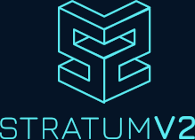

# Stratum V2 Explained

## Episode 0: Intro

<!-- _class: credit -->
by [`@plebhash`](https://plebhash.github.io)

---

## Intro

Stratum V2 is the next generation protocol for pooled mining. It increases security, makes data transfers more efficient, and reduces mining infrastructure requirements. It also introduces three new sub-protocols that let miners select transaction sets and **improve decentralization**.

This is a series os videos explaining Stratum V2 in depth.

---

## Acknowledgements

This series is based on [Gabriele Vernetti (GitGab19)](https://github.com/GitGab19)'s Master Thesis at *Politecnico Di Torino* titled:

[**Stratum V2: the next generation protocol for Bitcoin pooled mining**](https://github.com/GitGab19/Stratum-V2-Master-Degree-Thesis/blob/main/Stratum-V2-MD-thesis.pdf)

---

## Assumptions

We are not going to cover every single detail of the Bitcoin protocol. In summary, we assume the audience already has some basic understanding of what Bitcoin is.

If you don't know what Bitcoin is, we encourage you to read the [Bitcoin Whitepaper](https://bitcoin.org/bitcoin.pdf).

---

## Content

### Episode 1

- Mining
  - How mining works
  - Mining history and evolution
  - Solo mining and pooled mining

---

## Content

### Episode 2

- History of pooled mining protocols
  - `getwork`
  - `getblocktemplate`
  - `stratum` (SV1)

---

## Content

### Episode 3

- Stratum V2
  - What is SV2
  - How SV2 works
  - Differences between SV1 and SV2
  - Current implementations

---

## Content

### Episode 4

- Stratum Reference Implementation (SRI)
  - How SRI works
  - Getting started
  - Future ideas

---

# Enjoy!
