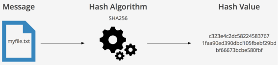
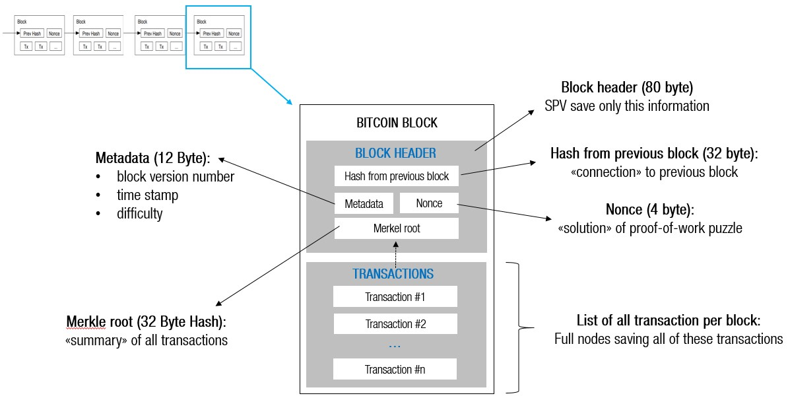
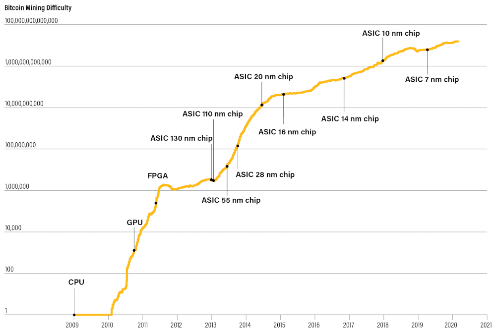
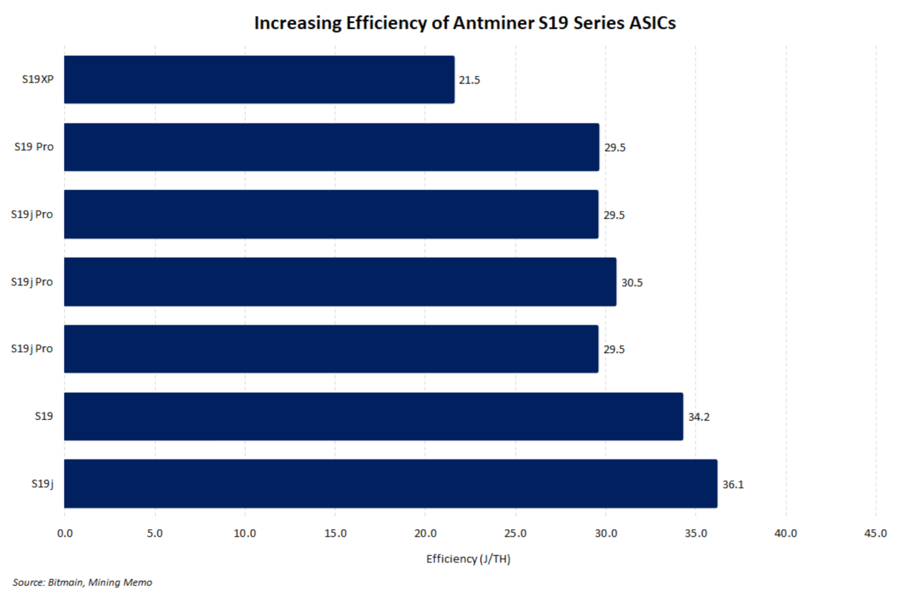
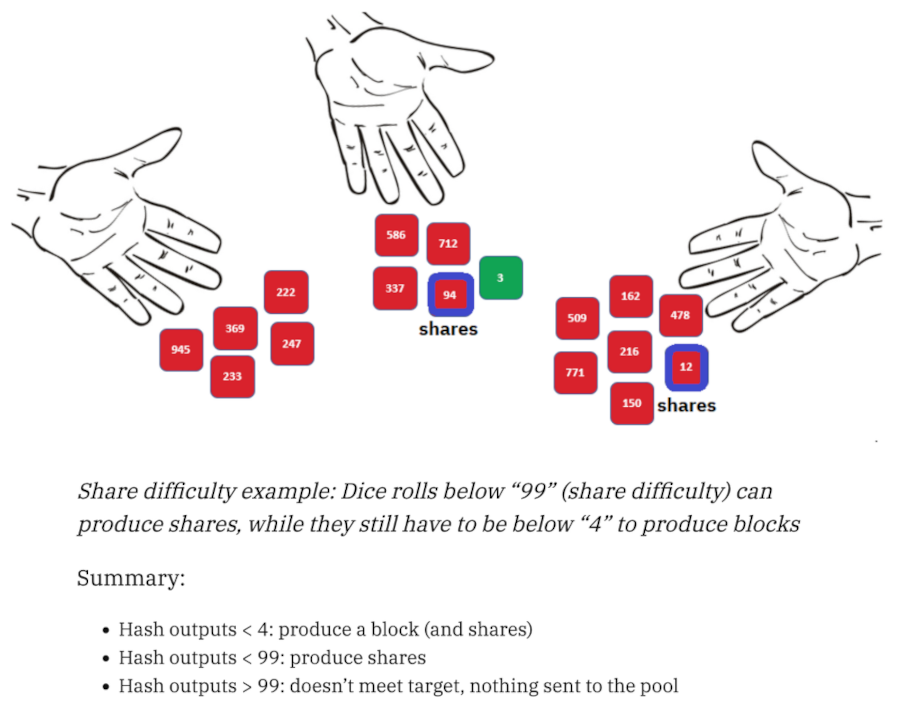

# Stratum V2 Explained

## Episode 1: Mining

<!-- _class: credit -->
by [`@plebhash`](https://plebhash.github.io)

---

## Acknowledgements

This series is based on [Gabriele Vernetti (GitGab19)](https://github.com/GitGab19)'s Master Thesis at *Politecnico Di Torino* titled:

[**Stratum V2: the next generation protocol for Bitcoin pooled mining**](https://github.com/GitGab19/Stratum-V2-Master-Degree-Thesis/blob/main/Stratum-V2-MD-thesis.pdf)

---

## Hash Function

A mathematical function that takes an input of any size ("preimage") and produces a number ("digest", or simply "hash") while following these properties:

- Deterministic
- Fixed size output (in bits)
- Preimage resistance
- Collision resistance

Although the hash is a binary number, it is usually encoded as a string of characters for human readability.

---

## Hash Function

Bitcoin uses a hashing algorithm called `SHA256`, defined under the [`FIPS PUB 180-4`](https://nvlpubs.nist.gov/nistpubs/FIPS/NIST.FIPS.180-4.pdf) Standard.

---

## How mining works

There are two main purposes for mining:
1. To permanently add transactions to the blockchain without the permission of any entity (e.g.: central bank 🏦).
2. To fairly distribute the 21M BTC supply and fee rewards to miners who spend real world resources (energy ⚡) to secure the network.

---

## How mining works

Bitcoin's **`difficulty target`** represents the maximum value that a block header hash can be in order to be considered valid for the entire network.

Miners need to find a block header (preimage) which generates a hash that satisfies the current `difficulty target` (readjusted every 2016 blocks).

---

## How mining works

Miners build the so-called candidate block with all the best transactions received from their full-nodes (usually the transactions that pays higher fees).

The corresponding block header includes the following fields:

- `parent block hash`: hash of the previous block in the blockchain.
- `version`: 4 bytes indicating the version of the Bitcoin protocol being used.
- `timestamp`: 4 bytes recording the [unix timestamp](https://www.unixtimestamp.com/) when the block was mined.
- `difficulty target`: 4 bytes representing the max allowed value for the block hash.
- `merkle root`: hash computed from all the txs included in the candidate block.
- `nonce`: 32-bit value that miners adjust trying to find a valid block hash.

---

---

## How mining works

The miner repeatedly changes the `nonce` value and applies a double `SHA256` to the block header until the output is smaller than the current `difficulty target`.

If the `difficulty target` is met, the miner adds the new mined block to its local copy of the blockchain and immediately broadcasts the new block to all the other peers which he is connected to.

The propagation of the new block needs to be as fast as possible since it’s crucial for the miner to claim the block reward.

---

## How mining works

The block reward consists of newly minted Bitcoin (subsidy) and transaction fees contained and encoded in the so-called **coinbase** transaction.

Differently from regular transactions in Bitcoin, this transaction does not use UTXOs as inputs. 

Instead, it contains only one input known as the coinbase, which essentially generates new Bitcoin out of nothing (subsidy + fees) while sending them to the miner's address.

---

## Mining history and evolution

The first block was mined by Satoshi Nakamoto on January 3, 2009.

In the beginning, the network `difficulty target` was `1`. The total number of miners was very small, so the difficulty didn’t increase, and it was possible to mine  blocks using an average personal computer. It was the only time in history when CPU mining was profitable. 

As mining received more media attention, the mining difficulty started to rise.

---

## Mining history and evolution

In October 2010, the first mining device based on GPUs was developed. The GPU’s excellence at computing simple mathematical operations in parallel caused the global hashrate increase, also increasing the overall network `difficulty target`.

In 2011 FPGAs came into the mining game. They were even faster than GPUs, contributing to the ever-increasing network hashrate, and and `difficulty target`.

---

## Mining history and evolution

In 2013 the Chinese company called Canaan Creative introduced the first set of ASIC designed exclusively for Bitcoin mining.

In contrast to CPUs, GPUs, and FPGAs, these ASIC devices were specifically built with the intention of being used exclusively for Bitcoin mining.

Soon other players like Bitmain and MicroBT also joined the game introducing their own models of ASICs. 

---

## Mining history and evolution

A significant evolution in ASIC technology has been the consistent reduction in chip size.

Beginning at a size of 130nm in 2013, the latest hardware models featuring sizes as small as 5nm. The transistor size reduction leads to an increasing efficiency in ASIC machines.

Nowadays, an ASIC bitcoin mining device is estimated to be 100 billion times more efficient than the average CPU back in 2009.

---

---

---

## Solo mining

In Solo mining, the miner relies solely on its own computational power to compete against the entire network in the race to find a valid block. 

The block reward is paid entirely to the solo miner. The miner's address is put into the coinbase output script. 

---

## Solo mining
<!-- 
footer: Source: Meni Rosenfeld. Analysis of bitcoin pooled mining reward systems. arXiv preprint arXiv:1112.4980, 2011.
 -->

The `difficulty target` $D$ is chosen so that every computed hash will lead to a valid block with probability $\frac{1}{2^{32}D}$.

A miner with hashrate $h$ mining for a period of time $t$, will calculate a total of $ht$ hashes, and so will find on average $\frac{ht}{2^{32}D}$ blocks.

If the reward for each block is $B$, the miner's expected reward is thus $\frac{htB}{2^{32}D}$.

---

## Solo mining

### Example

Bob can perform a billion hash calculations per second: $h = 1 \textrm{Ghash/s} = 10^9 \textrm{hash/s}$.

If Bob mines continuously for a day (86400 seconds) when the `difficulty target` is $D = 1690906$ and the block reward is $B = 50 \textrm{BTC}$, he will find on average $\frac{ht}{2^{32}D} = \frac{10^9\textrm{hash/s·86400s}}{2^{32}1690906} ≈ 0.0119$ blocks, and receive payment of
$0.0119B = 0.595$ BTC on average.

---

## Solo mining variance

Finding a block on solo mining is a Poisson process with $\frac{h}{2^{32}D}$ as the rate parameter.

Mining for time $t$ results in $\frac{ht}{2^{32}D}$ blocks on average, so the number of mined blocks follows a Poisson distribution with $λ=\frac{ht}{2^{32}D}$, and this quantity is also the variance of the number of blocks found.

The variance of the payout is then $λB^2=\frac{htB^2}{2^{32}D}$, and the relative standard deviation (as a fraction of the expected reward) is $\frac{\sqrt{λB^2}}{λB} = \frac{1}{\sqrt{λ}} = \sqrt{\frac{2^{32}D}{ht}}$.

---

## Solo mining variance

### Example

Bob (from the previous example) has a variance of $0.0119B^2 = 29.75 \textrm{BTC}^2$ in his payout. The standard deviation is $\sqrt{29.75\textrm{BTC}} ≈ 5.454 \textrm{BTC}$, which is $917$% of the expectation. In fact, the probability that Bob will receive **ANY PAYMENT AT ALL** for his day of mining is $1 − e^{−λ} ≈ 1.18$%.

How can Bob build a sustainable business model based on ~1% chance of profit?

---

## Solo mining → Pooled mining
<!-- 
footer: ""
 -->
As the global hashrate increased, mining transformed into an industrial activity.

Miners had to consider many factors for their business activity, such as the prohibitive variance of finding valid blocks during solo mining.

The concept of pooled mining become a popular solution to this problem.

---

## Pooled mining

Pools are systems where multiple miners combine their hashing power and share the resulting rewards.

The candidate block is built to pay the reward to the pool's Bitcoin address.

Individual miners connect their mining equipment to the pool server. Each miner communicates a Bitcoin address to the pool, which is used to receive their share of the rewards.

---

## Pooled mining

The mining hardware remains connected to the pool server while mining, synchronizing their efforts with the other miners.

The main business model of the pool operators is typically a percentage fee which is cut off from the rewards collected by miners.

---

## Pooled mining

### Shares

The pool accounts for the work done by each individual miner via **shares**, which are block header hashes mined under a lower `difficulty target`.

---

---

## Pooled mining

### Shares

When someone in the pool successfully mines a block, the reward is earned by the pool and then shared with all miners in proportion to the number of shares they contributed to the effort.

---

## Pooled mining

The first mining pool ever created was the so called **Slushpool** (now known as Braiins), born in 2010.

Since then, the need for mining pool operations has greatly increased.

In order to manage all the communications between individual miners and mining pool servers, some kind of specialized pooled mining protocol had to be developed.

---

### Next Episode

- History of pooled mining protocols
  - `getwork`
  - `getblocktemplate`
  - `stratum` (SV1)
