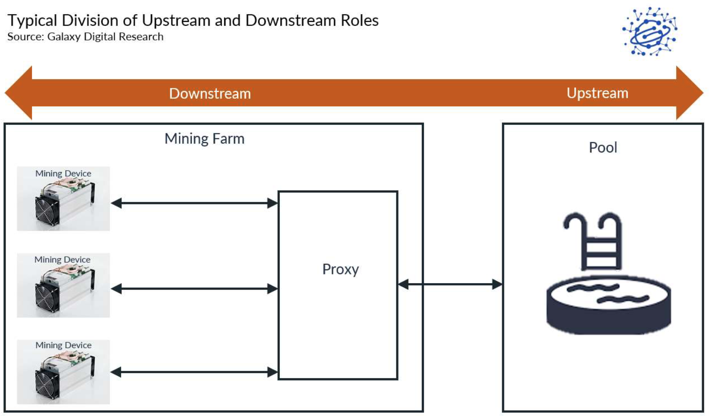
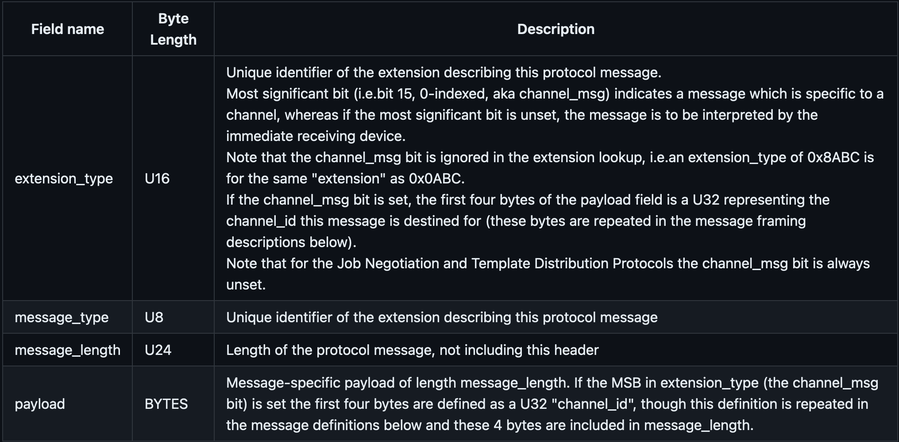
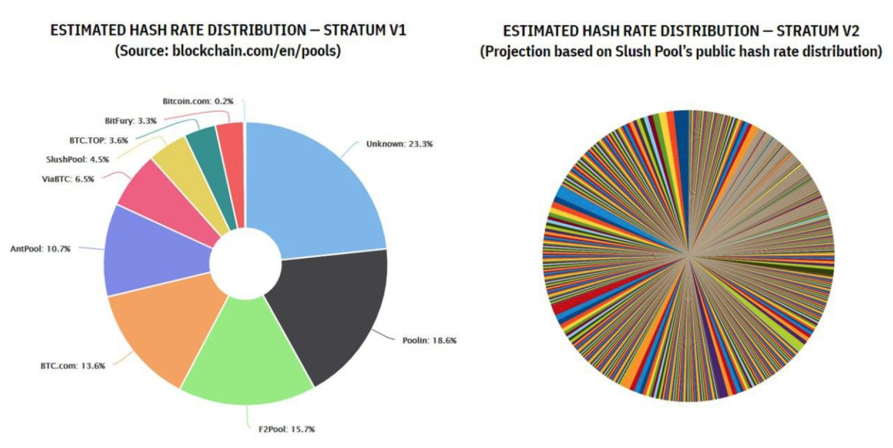
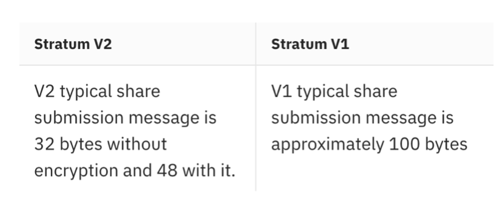
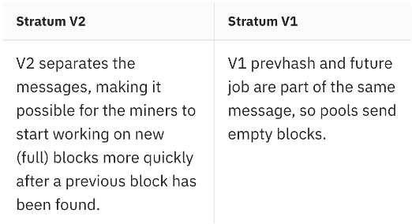
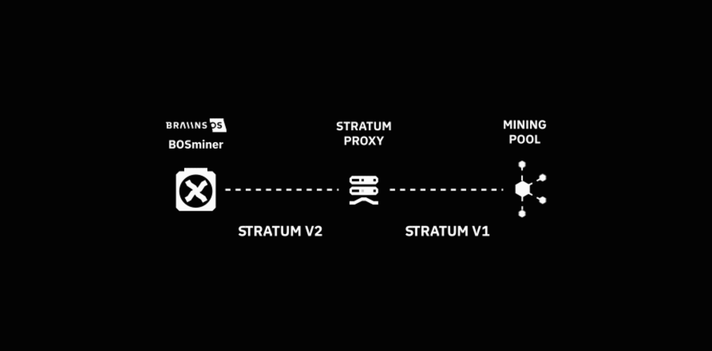

# Stratum V2 Explained

## Episode 3: Stratum V2

<!-- _class: credit -->
by [`@plebhash`](https://plebhash.github.io)

---

## Acknowledgements

This series is based on [Gabriele Vernetti (GitGab19)](https://github.com/GitGab19)'s Master Thesis at *Politecnico Di Torino* titled:

[**Stratum V2: the next generation protocol for Bitcoin pooled mining**](https://github.com/GitGab19/Stratum-V2-Master-Degree-Thesis/blob/main/Stratum-V2-MD-thesis.pdf)

---

# What is SV2: why and when it was born

---

SV2 was initially proposed in 2019. It was introduced by Pavel Moravec and Jan Čapek (Braiins), in collaboration with Matt Corallo and other experts in the mining field.

SV2 was proposed to address the limitations and shortcomings of SV1 (as explained in episode 2 of this series).

---

---

# How SV2 works

## Roles

Roles are involved in data flow and can be classified as either downstream or upstream in relation to each other.

---

### Mining Device

The mining device is the physical hardware that carries out the hashing process. It is considered the most downstream role.

---

### Pool Service

This role belongs to the entity where the actual hashrate produced by the mining devices is consumed. It is considered the most upstream role.

---

### Mining Proxy

This role represents the proxy server situated between the mining device and the pool service. It handles message coordination and aggregation. In relation to the mining device, it is considered upstream, while in relation to the pool service, it is considered downstream.

---

### Template Provider

This role is fulfilled by a Bitcoin client responsible for generating custom block templates. These templates are then sent to the Job Negotiator for mining purposes.

---

### Job Negotiator

The job negotiator receives transactions from the Template Provider (which is essentially the Bitcoin client) and constructs custom block templates. It also negotiates the use of these templates with the pool.

---

---

## Sub-protocols

There are three distinct sub-protocols needed in order to fully use all of the features proposed in SV2:
- Mining Protocol
- Job Negotiation Protocol
- Template Distribution Protocol

---

### Mining Protocol

The mining protocol is the primary protocol used for mining and serves as the direct successor to Stratum (V1).

It enables communication between a mining device and its upstream node, pool, or proxy. This protocol is essential and must be implemented in all mining scenarios.

In cases where a miner or pool does not support transaction selection, the mining protocol is the only protocol used.

---

### Mining Protocol

The protocol defines three types of communication channels:

- **Standard channels**: they don’t manipulate the Merkle path / coinbase transaction, greatly simplifying the communication required between them and upstream nodes.

- **Extended channels**: they are given extensive control over the search space so that they can implement advanced use cases (e.g. translation between V1 and V2, difficulty aggregation, custom search space splitting, etc.).

- **Group channels**: they are simply collections of standard channels that are opened within a particular connection so that they are addressable through a common communication channel.

---

### Job Negotiation Protocol

The job negotiation protocol is utilized by a miner, typically a mining farm, to negotiate a block template with a pool. The results of this negotiation can be reused for all mining connections to the pool, reducing computational intensity.

In other words, a single negotiation can be applied to an entire mining farm or even multiple farms with a large number of devices, leading to greater efficiency.

This protocol is separate to allow pools to terminate these connections on separate infrastructure from mining protocol connections.

---

### Template Distribution Protocol

The template distribution protocol shares a similar structure to facilitate obtaining information about the next block from Bitcoin Core.

It is designed to replace `getblocktemplate` with a more efficient and easier-to-implement solution for those incorporating other aspects of Stratum V2 into their systems.

---

## SV2 protocol security

[Authenticated Encryption with Associated Data (AEAD)](https://en.wikipedia.org/wiki/Authenticated_encryption#Authenticated_encryption_with_associated_data) is used to provide both confidentiality and integrity for all SV2 communication channels.

---

Before opening any SV2 channels for mining, clients MUST first initiate the cryptographic session state that is used to encrypt all messages sent between themselves and servers.

Thus, the cryptographic session state is independent of SV2 messaging conventions.

---

SV2 also introduces the optional use of a particular handshake protocol based on the [Noise Protocol framework](http://www.noiseprotocol.org/).

The client and server establish secure communication using Diffie-Hellman (DH) key agreement.

---

Using the handshake protocol to establish secured communication is optional on the local network (e.g. local mining devices talking to a local mining proxy).

However, it is mandatory for remote access to the upstream nodes, whether they be pool mining services, job negotiating services or template distributors.

---

## SV2 binary framing

The Stratum V2 protocol is binary, with fixed message framing. Each message begins with the extension type, message type, and message length (six bytes in total), followed by a variable length message.

---

## SV2 binary framing

---

## SV2 transaction selection

In SV1, the selection of the transactions to be inserted in the block templates, which are distributed as jobs to the miners, is a pool responsibility. 

They are the only entities who took valid Bitcoin transactions from the mempool and decide the ones who will be mined in the next block are the pool operators. Since pool are public entities, they can be attacked from governments, and this is not so ideal for the censorship-resistance property of the Bitcoin network as a whole.

---

With SV2, miners now have the ability to choose their own work (i.e. choose their own transaction set), making mining process more decentralized. This is implemented separately from the main mining protocol, as described previously, and it is optional for pools and miners. 

---

---

# Differences between SV1 and SV2

---

## Bandwidth consumption

The use of a binary protocol instead of a text-based one significantly reduces bandwidth usage. In SV1, making messages readable by humans resulted in some messages being unnecessarily large, approximately 2-3 times bigger than needed.

However, in SV2, these messages have been minimized to their essential size. Furthermore, SV1 includes certain unnecessary messages like `mining.subscribe`, which have been eliminated in SV2.

---

---

## Server CPU load

Thanks to the introduction of standard and group channels, SV2 achieves a reduction in server CPU load by implementing header-only mining for end devices. This implies that the Merkle root, which was previously handled by end devices, is now always provided by an upstream node.

Consequently, the computational load on end devices is lighter since there’s no need to perform any coinbase modifications. This simplifies the work for miners and, at the same time, significantly lightens the workload required for work validation on the server side.

---

## Header-only mining

Stratum V2 introduces the possibility for miners to open standard mining channels that don’t permits coinbase transaction manipulation. In other words, end mining devices don’t do any extranonce or Merkle path handling. This process if called header-only mining.

---

## Header-only mining

The size of the search space for a device doing header-only mining for a particular value in the `nTime` field is $2^{NONCE\_BITS + VERSION\_ROLLING\_BITS} = 280Th$, where $NONCE\_BITS = 32$ and $VERSION\_ROLLING\_BITS = 16$.

This is a guaranteed search space before `nTime` rolling. The client that opens a particular standard channel owns the entire assigned search space and can split it further (e.g. between multiple hashing boards or individual chips) if necessary.

---

## Binary vs non-binary

SV2 has fixed message framing and it is precisely defined, which means that there isn’t room for different interpretations of SV2 like there was with V1.

Instead, SV1 protocol relies on `JSON`, which has a sub-optimal ratio between the size of the message payload and the actual information transmitted. By transforming SV2 into a binary protocol, the data efficiency significantly improves. This enhanced efficiency allows for the saved bandwidth to be allocated towards more frequent job submissions, thereby reducing hashrate variance.

---

## Job distribution latency

In SV1, mining pool servers send jobs to miners containing both the prevhash and Merkle root of the transaction lists to be included in the next block (this is done using the SV1 mining.notify message). 

So, these two pieces of data aren’t separable, so there is a heavy (slow) data transfer necessary to distribute new jobs as soon as a new block (with a new prevhash) has been found and propagated.

---

## Job distribution latency

In SV2, it’s possible to separate the `prevhash` from the rest of the predefined block data, which allows for the block data to be sent before a new `prevhash` is available.

As a result, the new `prevhash` message can be sent on its own as soon as a valid block is found, and this transmission can occur much faster because the message doesn’t include heavier data. This enables miners to begin working on new jobs more quickly than they could with SV1.

---

---

## Man-in-the-middle attack prevention

SV2 introduces a type of encryption scheme called AEAD (authenticated encryption with associated data) to address the security aspects of all communication that occurs between miners and pool servers. This provides both confidentiality and integrity for the ciphertexts (i.e. encrypted data) being transferred, as well as providing integrity for associated data which is not encrypted. 

---

## Man-in-the-middle attack prevention

SV2 uses authenticated encryption with associated data (AEAD) so that possible adversaries will be unable to use share submission data to identify particular miners, thus maintaining the privacy of miners and protecting them against hashrate hijacking.

---

## Empty block mining elimination

The elimination of the incentive for empty block mining comes down to the separation of the `prevhash` message from other block header data. With SV1, there is an incentive for pools to send empty blocks containing the new `prevhash` as soon as possible, as these messages will arrive faster than a message containing a full block.

---

## Empty block mining elimination

By separating these two messages in SV2, it’s now possible for pools to send full blocks to miners before the new `prevhash` message. In other words, the miners can be prepared to start working on a new (full) block before the previous block has been found, and then all they need is the new prevhash message to begin working on that next block.

Since this `prevhash` message is the same size (i.e. takes the same amount of time to arrive) regardless of whether or not the pool has sent an empty block or a full block, there is no longer an incentive to mine on empty blocks.

---

## Job selection

Job selection by end miners has been included as an optional component of SV2, separate from the main mining protocol. The name Job ’Negotiation’ Protocol is telling, as job selection is indeed a negotiation process between a miner and a pool. The miner proposes a block template, and it is up to a pool to accept or reject it.

Once a negotiated template has been accepted, the results can be used by any number of mining devices, even hundreds of thousands of them. The reason this is separate from the main mining protocol is to allow pools to terminate connections on separate infrastructure from the main mining protocol, that way there is no impact on the efficiency of actual share submissions.

---

## Multiplexing

In SV2, there can theoretically be as many as $2^32$ (around 4.3 billion) open channels within a single physical connection (e.g. TCP) to an upstream stratum node.

These channels are independent and have unique channel IDs, meaning that many devices can simultaneously receive different job assignments using the same connection, saving on infrastructure costs. At the same time, the channels may all share some information for greater efficiency, such as when a new prevhash is broadcasted.

---

## Native version rolling

Each Bitcoin block header contains a version field whose bits can be freely used to extend the search space for a miner. Rolling the version bits can greatly reduce the frequency with which new jobs need to be distributed, and it’s already a common technology [BIP320](https://en.bitcoin.it/wiki/BIP_0320). With SV2, version rolling becomes a native part of the mining protocol.

---

# Current implementations

---

## BraiinsOS

As explained in the previous sections, Stratum V2 protocol specifications were designed and published in the late 2019. However, the first SV2 implementation appeared in the first half of 2020, announced from the Braiins team, again. They developed a first basic Stratum V2 implementation, which was directly incorporated in their own Braiins OS firmware.

---

## BraiinsOS

"That’s finally ready to change. Today, we are launching a new product that includes a working implementation of Stratum V2 as well as additional autotuning functionality that has strong user demand. The product is an ASIC firmware called BraiinsOS, which was the first mining firmware to implement overt AsicBoost back in 2018 and is also the first fully-open source firmware in the industry.

---

## BraiinsOS

Initially, the Braiins team focused on implementing the ASIC protocol logic in the ASIC’s firmware, suggesting to use a translation proxy which was in charge of translating the SV2 messages received from the SV2 firmware-miner. As described in 5.5, in that manner the proxy would let the miner communicate correctly with any mining pool which was supporting only Stratum (V1).

In that way, any miner could take advantage of the security and data efficiency brought by Stratum V2 protocol, using an encrypted communication channel and the binary framing defined in the SV2 specs.

---

## BraiinsOS

However, after some months, the Braiins co-founders (co-authors of the SV2 specifications) decided to pass the future development of the protocol to someone who was external to their business. Doing this, they declared that the Stratum V2 protocol implementation should have been done by an independent community, without having the responsibility to be linked in some way to the Braiins company itself.

---

---

## Stratum Reference Implementation (SRI)

During 2020 a new group of people composed by independent developers started to work on a fully open-source implementation of Stratum V2, called SRI (Stratum Reference Implementation).

The purpose of SRI group is to build, beginning from the SV2 specifications discussed in the previous section, a community-based implementation, with the aim to discuss and open the development with as many people of the Bitcoin community as possible.

The SRI group has also been expanding the SV2 features already covered by the Braiins implementation.

---

### Next Episode

- Stratum Reference Implementation (SRI)
  - How SRI works
  - Future ideas