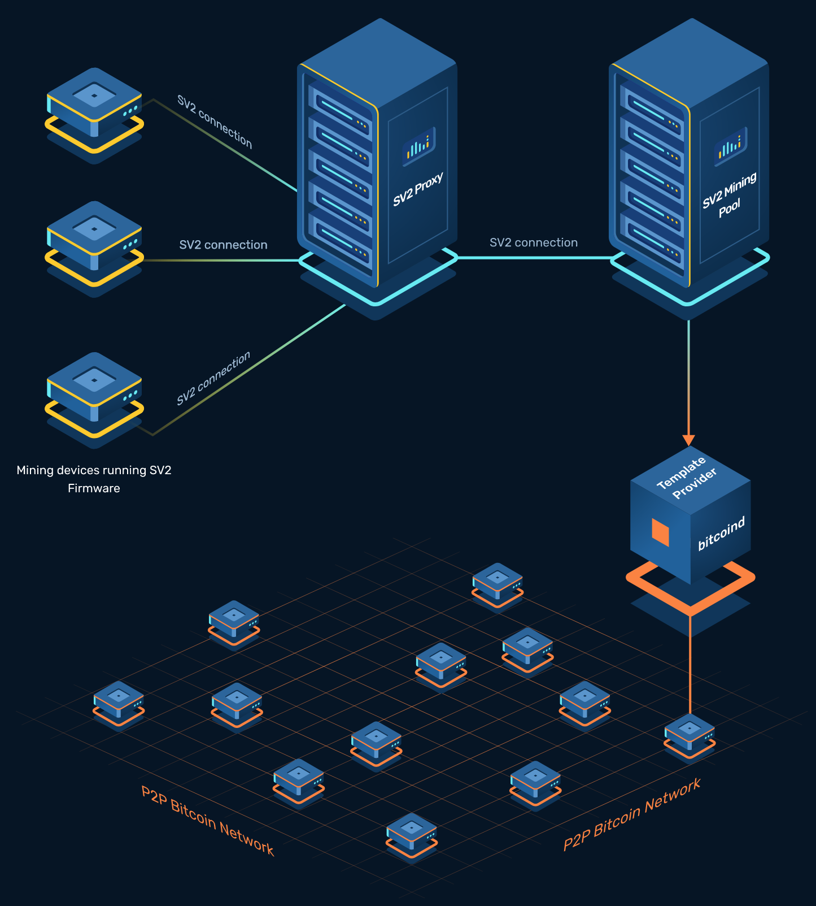
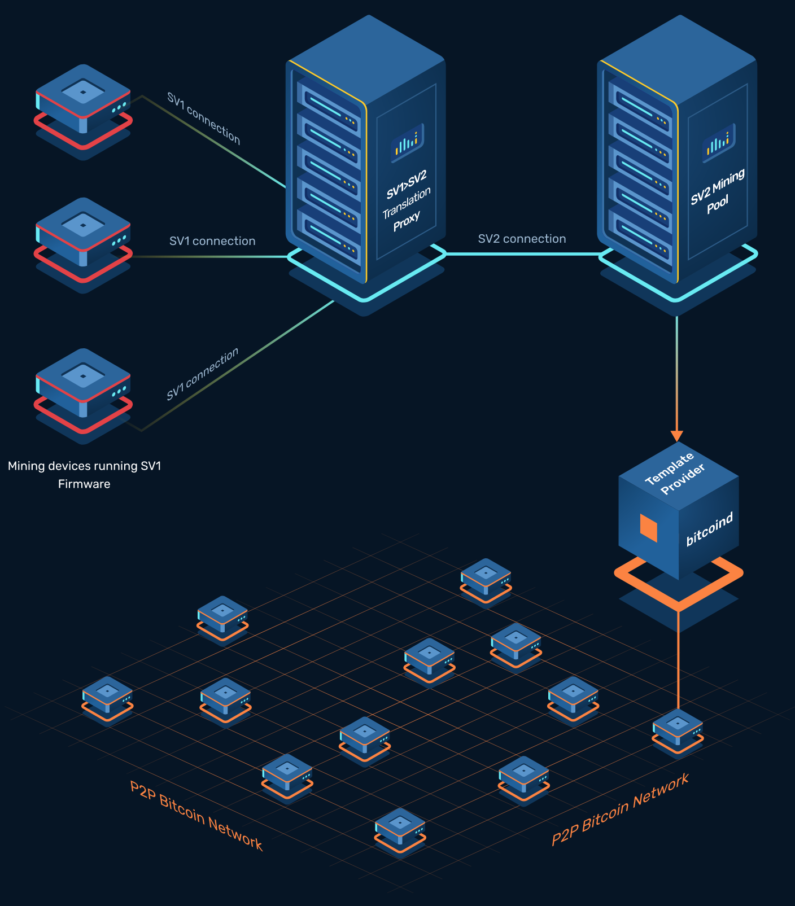
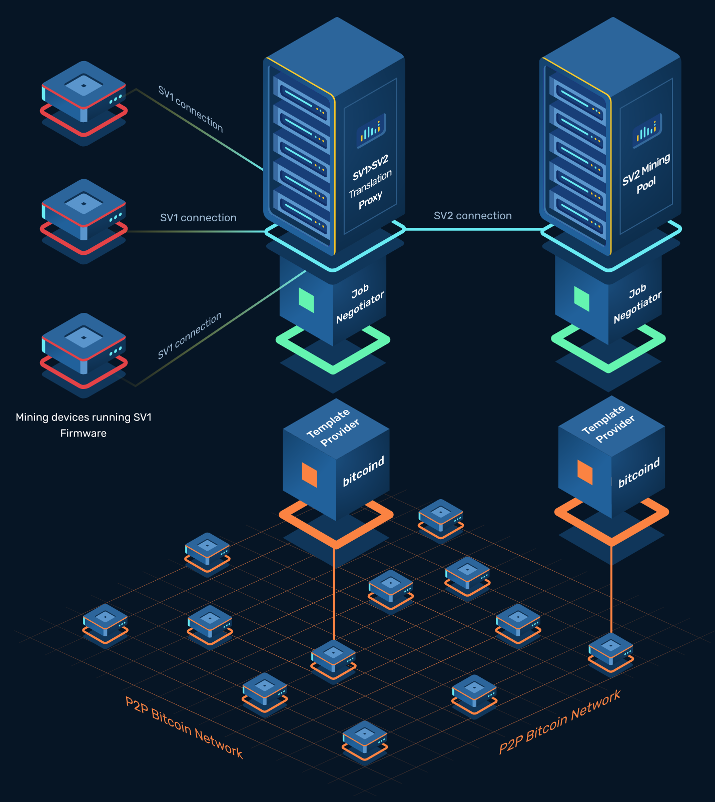

# Stratum V2 Explained

## Episode 4: Stratum Reference Implementation (SRI)

<!-- _class: credit -->
by [`@plebhash`](https://plebhash.github.io)

---

## Acknowledgements

This series is based on [Gabriele Vernetti (GitGab19)](https://github.com/GitGab19)'s Master Thesis at *Politecnico Di Torino* titled:

[**Stratum V2: the next generation protocol for Bitcoin pooled mining**](https://github.com/GitGab19/Stratum-V2-Master-Degree-Thesis/blob/main/Stratum-V2-MD-thesis.pdf)

---

# Intro

---

Stratum Reference Implementation (SRI) is a full open-source, community based implementation of the SV2 protocol specifications.

---

The team started in 2020, and it’s composed by independent developers majorly funded by individual grants. The project is supported by many companies involved into mining operations, such as Braiins, Foundry, Galaxy Digital.

In addition to them, other entities are also involved, such as: Bitmex, Human Rights Foundation, Spiral and the Summer of Bitcoin.

---

Nowadays, most of the implementation work has been done, but there are still some open discussions related to the protocol specifications, such as roles structure, noise encryption, job negotiation/declaration protocol.

There's also an ongoing effort for fixing bugs and getting feedback from the community.

---

# How SRI works

---

## SRI Roles

SRI provides a well defined set of these new roles, which are contained in the `roles` folder of its Rust codebase.

---

### SV2 Pool

This role represents a Stratum V2 Pool server. It can open any kind of communication channels with downstream roles (proxies or mining devices).

---

### SV2 Mining Proxy

The SV2 Mining Proxy acts as an intermediary between the mining devices and the SV2 Pool.

It receives mining requests from multiple devices, aggregates them, and forwards them to the SV2 pool.

It can open group/extended channels with upstream (the SV2 pool) and standard channels with downstream (SV2 Mining Devices).

---

### SV2 Mining Device

This role represents a conceptual Mining Device written in Rust that is compatible with SRI stack. It can connect to an SV2 Pool or Mining Proxy and performs the mining operations.

---

### SV1-SV2 Translator Proxy

The SV1-SV2 Translator Proxy is responsible for translating the communication between SV1 Mining Devices and an SV2 Pool or Mining Proxy.

It enables SV1 devices to interact with SV2-based mining infrastructure, bridging the gap between the older SV1 protocol and SV2. It can open extended channels with upstream (the SV2 pool or Mining Proxy).

---

### Job Declarator Server

xxx todo xxx

---

### Job Declarator Client

xxx todo xxx

---

### Template Provider

Enables the extraction of transactions from the Bitcoin nodes which are miner-side. In this way, miners are now able to create custom block templates and negotiate their use with the Job Negotiator via the Job Negotiation Protocol.

---

# SRI configurations

Thanks to all these different roles and sub-protocols, SV2 can be used in many different mining contexts.

The SRI working group defined 4 main possible configurations which can be the most probable real use-cases, and they are defined as the following listed.

---

## Configuration A

Before SV2, transaction sets to be mined in the next blocks were selected by pools. With this SV2 configuration they’re selected by individual miners, making the network more censorship-resistant.

In this case, miners run SV2 compatible firmware, connecting to the SV2 Mining Proxy. 

Using the Job Declarator role, individual miners are able to pick up their transactions locally, extracting them from their local Template Provider, and declare them to an SV2 Pool.

---

---

## Configuration B

Mining Devices run SV2 firmware, so they are able to connect to a SV2 Mining Proxy (typically through a standard channel). The proxy aggregates all the standard channels opened into just one open channel with the SV2 Pool (group channel or an extended channel).

In this configuration, the Proxy doesn’t have the Job Declarator setup, so it’s unable to select transactions from its local Template Provider.

Transactions selection is done by the SV2 Pool, as it was done in SV1, but now it can benefit from all the security and performance features brought by SV2.

---

---

## Configuration C

With this setup, Mining Devices don’t need to run a SV2 compatible firmware. The Translator Proxy to translate the SV1 messages that come from the Mining Device into SV2 messages for the SV2 Pool.

In this case, the Translator Proxy is not configured to talk to a local Template Provider, so transactions selection is done by the pool.

However, this configuration allows SV2 protocol features without installing SV2 firmware on the machines.

---

---

## Configuration D

This configuration is very similar to config C, but it’s able to add the transactions selection feature to it.

The miner runs a Translator Proxy plus a Job Declarator Client and a Template Provider.

The miner is able, in this way, to build its own block templates and declare them to the SV2 Pool, through an extended channel.

---

---

## SRI benchmarking suite

A major mining protocol update like the one proposed by the SRI is very sensitive, due to the ever growing importance of the mining operations of nowadays.

In order to encourage Stratum V2 wide adoption, the SRI developers group think that a complete evaluation and precise measurements of the enhancements brought by SV2 is needed.

A benchmarking suite which is able to easily test and benchmark protocol performances in different mining scenarios, capable of comparing the current version of SV1 with SV2 is necessary.

---

## SRI benchmarking suite

In this way, mining industry professionals and the broader market will be able to easily understand every possible configuration permitted by SRI, evaluating and measuring themselves the potential benefits in terms of efficiency and consequently, profitability.

The main purpose of benchmarking is to demonstrate, with precise measurements, all the performance improvements brought by SV2, pushing at this point its natural adoption by both miners and mining pools.

---

### Next Episode

- SRI Tutorial
  - Prerequisites
  - Config C setup
  - CPUminer
  - ASIC
