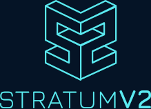
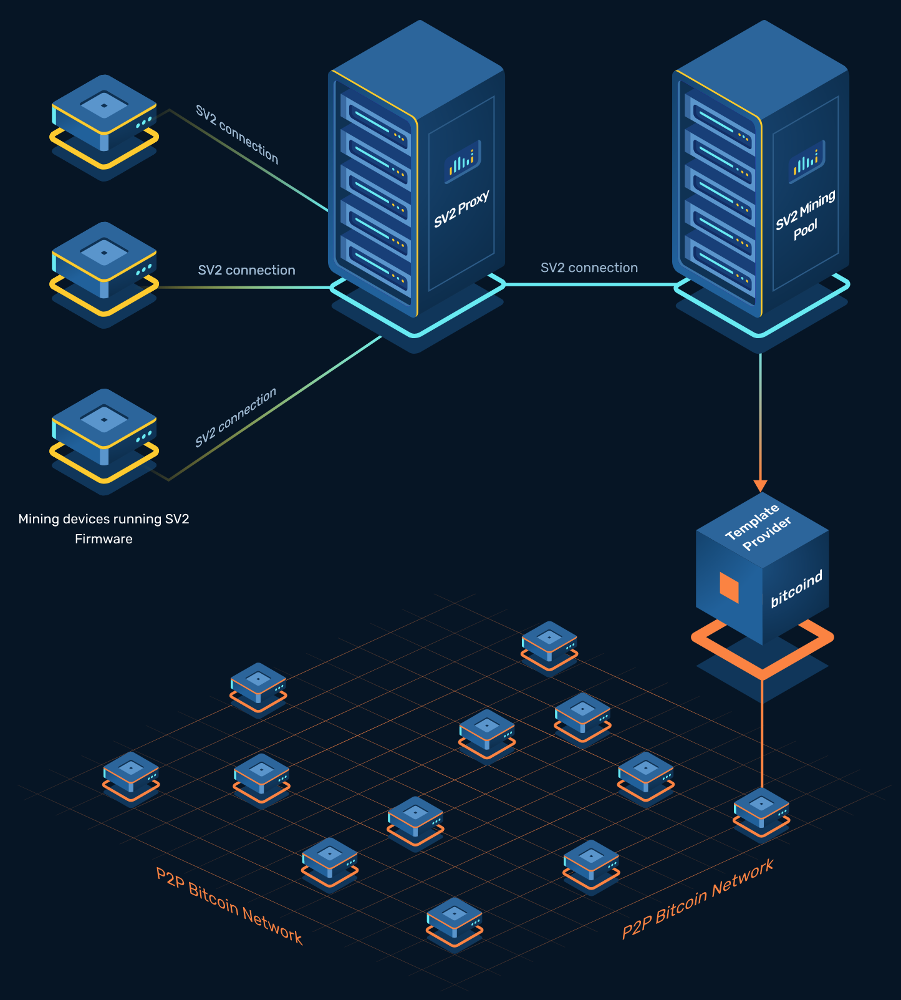
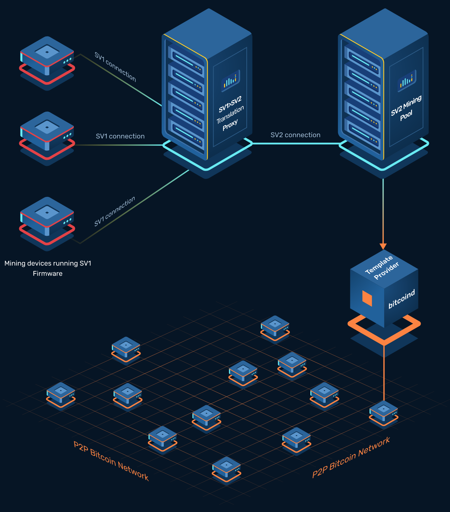
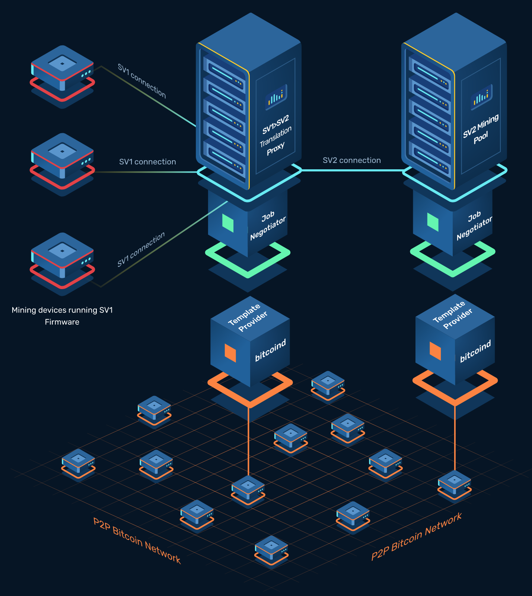

# Stratum V2 Explained

## Episode 4: Stratum Reference Implementation (SRI)

<!-- _class: credit -->
by [`@plebhash`](https://plebhash.github.io)

---

## Acknowledgements

This series is based on [Gabriele Vernetti (GitGab19)](https://github.com/GitGab19)'s Master Thesis at *Politecnico Di Torino* titled:

[**Stratum V2: the next generation protocol for Bitcoin pooled mining**](https://github.com/GitGab19/Stratum-V2-Master-Degree-Thesis/blob/main/Stratum-V2-MD-thesis.pdf)

---

## Intro

Stratum Reference Implementation (SRI) is a full open-source, community based implementation of the SV2 protocol specifications.

The team started in 2020, and it’s composed by independent developers majorly funded by individual grants. The project is supported by many companies involved into mining operations, such as Braiins, Foundry, Galaxy Digital. In addiction to them, there are engaged also entities like Bitmex, Human Rights Foundation, Spiral and the Summer of Bitcoin.

Nowadays, most of the implementation work has been done, but there are still some open discussions related to the protocol specifications, such as roles structure, noise encryption, job negotiation/declaration protocol.

---

# How SRI works

## SRI Roles

SRI provides a well defined set of these new roles, which are contained in the `roles` folder of its Rust codebase.

---

### SV2 Pool

This role represents a Stratum V2 Pool server. It can open any kind of communication channels with downstream roles (proxies or mining devices).

---

### SV2 Mining Proxy

The SV2 Mining Proxy acts as an intermediary between the mining devices and the SV2 Pool. It receives mining requests from multiple devices, aggregates them, and forwards them to the SV2 pool. It can open group/extended channels with upstream (the SV2 pool) and standard channels with downstream (SV2 Mining Devices).

---

### SV2 Mining Device

This role represents a conceptual Mining Device written in Rust that is compatible with SRI stack. It can connect to an SV2 Pool or Mining Proxy and performs the mining operations.

---

### SV1-SV2 Translator Proxy ( + Job Negotiator)

The SV1-SV2 Translator Proxy is responsible for translating the communication between SV1 actual Mining Devices and an SV2 Pool or Mining Proxy. It enables SV1 devices to interact with SV2-based mining infrastructure, bridging the gap between the older SV1 protocol and SV2. It can open extended
channels with upstream (the SV2 pool or Mining Proxy).

If correctly configured, it can act as a Job Negotiator, so it can enable the transaction selection feature for the miners which are connected to it.

---

### Template Provider

enables the extraction of transactions from the Bitcoin nodes which are miner-side. In this way, miners are now able to create custom block templates and negotiate their use with the Job Negotiator via the Job Negotiation Protocol.

On June 11 2023 the first Pull Request to add a SV2 template provider natively in Bitcoin Core ([PR #27854](https://github.com/bitcoin/bitcoin/pull/27854)) was opened and discussed on the Bitcoin Core repository.

---

# SRI configurations

Thanks to all these different roles and sub-protocols, SV2 can be used in many different mining contexts. The SRI working group defined 4 main possible configurations which can be the most probable real use-cases, and they are defined as the following listed.

---

## Configuration A

Before SV2, transaction sets to be mined in the next blocks were selected by pools. With this SV2 configuration they’re selected by individual miners, making the network more censorship-resistant.

In this case, miners run SV2 compatible firmware, connecting to the SV2 Mining Proxy. 

Using the Job Negotiator role, individual miners are able to pick up their transactions locally, extracting them from their local Template Provider, and declare them to an SV2 Pool.

---

---

## Configuration B

Mining Devices run SV2 firmware, so they are able to connect to a SV2 Mining Proxy (typically through a standard channel). The proxy aggregates all the standard channels opened into just one open channel with the SV2 Pool (group channel or an extended channel).

In this configuration, the Proxy doesn’t have the Job Declarator setup, so it’s unable to select transactions from its local Template Provider.

Transactions selection is done by the SV2 Pool, as it was done in SV1, but now it can benefit from all the security and performance features brought by SV2.

---

---

## Configuration C

With this setup, Mining Devices don’t need to run a SV2 compatible firmware. The Proxy which is used to let for efficiency, is also able to translate the SV1 messages that come from the Mining Device into SV2 messages for the SV2 Pool.

In this case, the Translator Proxy is not configured to talk to a local Template Provider, so transactions selection is done by the pool. However, this configuration permits to test and use the SV2 protocol features without installing any other SV2 firmware on the machines.

---

---

## Configuration D

This configuration is very similar to the previous (config C), but it’s able to add the transactions selection feature to it. The Translator Proxy is joined by a Job Negotiator and a Template Provider: it’s able, in this way, to build its own block templates and declare them to the SV2 Pool, through an extended channel.

---

---

# Future ideas

---

## SRI Pool fallback

The SRI Pool fallback is a feature which is already in the SRI roadmap, and it will be a very crucial piece of the protocol.
 
Basically, once the last little changes about the Job Declarator Protocol will be done, a miner who aims to work with a setup like the previously analyzed Config D (6.1), or even better Config A (6.1), will be able to build its own block templates, extracting the most profitable Bitcoin transactions from its local Template Provider. 

---

## SRI Pool fallback

The miner will have a Job Declarator Client who is in charge of declaring this own block template to the Job Declarator Server (JDS) which will be Pool-side. The Pool-side JDS can still refuse the block template proposed by the miner (for any reason, could also be for censorship imposed by States or governmental agencies), and if this will be the case, the Job Declarator Client will automatically declare the same block template (containing the same transactions set) to another JDS of another mining Pool, choosing from a customized pre-configured backup list.

---

## SRI Pool fallback

In the very extreme case in which all the JDS of the backup Pools are refusing the block template proposed by the miner, it will automatically start to do solo mining, without the need of any manual intervention.

By doing in this way, any possible future attacks to the censorship-resistance of the entire network will be extremely disincentivized and ineffective.

---

## Non-custodial pools

Another subject of research of the SRI group is related to the current centralized and trusted payout mechanism used by the actual mining pools. The addresses inserted into the coinbase output to get the block reward is the ones belonging to the mining pools operators. Then, accordingly to the shares submitted from every miner who joins the pool, this reward is split and sent to the miners, through normal asynchronous Bitcoin transactions.

---

## Non-custodial pools

The concentration of the entire funds in a central entity exposes pooled mining operations to a significant risk. As the payout process is based on a trusted centralized third-party pool service, miners must place complete trust in the fairness of their payouts, without the ability to independently verify whether the pool is withholding a portion of their rewards, a practice known as pool skimming.

The most valuable solution to address this issue is based on implementing a payout scheme where miners directly collect the coinbase reward, without the need for a centralized pool to control their funds: in this way, it would be possible to operate a fully non-custodial pool.

---

## Non-custodial pools

In the past, some possible solutions emerged from the market, but the most promising one was called P2Pool, who was announced in this way: 

> P2Pool is a decentralized pool that works by creating a P2P network of miner nodes. These nodes work on a chain of shares similar to Bitcoin’s blockchain. Each node works on a block that includes payouts to the previous shares’ owners and the node itself.

> There is no central point of failure, making it DoS resistant.

However, its payout scheme was based on locking funds to miners’ individual addresses within the coinbase transaction outputs, leading to a significant increase in the size of the coinbase: for this reason it revealed to be a very inefficient solution.

---

## Non-custodial pools

Three developers from the SRI team, published a `RFC` containing their own new payout scheme for a non-custodial mining pool on the bitcoin dev list. As stated into the document:

> Our scheme is introduced through the concept of a payment pool, where the participants are the miners of the mining pool. The presented payment pool scheme uses `ANYPREVOUT`, does not rely on any off-chain technology and it is trustless, in the sense that a participant does not have to trust in collaboration of all other participants: a non-collaborating participant is automatically ejected from the payment pool and it is not a threat for accessibility of funds.

> Our study assumes the pool to be centralised, but it can be generalised to decentralised pools. Our payment pool scheme is meant to be a future extension of SV2 mining protocol.

---

## Braidpool

Another non-custodial pool was proposed by Bob McElrath, called [Braidpool](https://github.com/mcelrath/braidcoin/blob/master/braidpool_spec.md).

xxx todo xxx

---

## SRI benchmarking suite

A major mining protocol update like the one proposed by the SRI is very sensitive, due to the ever growing importance of the mining operations of nowadays.

In order to encourage Stratum V2 wide adoption, the SRI developers group think that a complete evaluation and precise measurements of the enhancements brought by SV2 is needed. A benchmarking suite which is able to easily test and benchmark protocol performances in different mining scenarios, capable of comparing the current version of SV1 with SV2 is necessary.

---

## SRI benchmarking suite

In this way, mining industry professionals and the broader market will be able to easily understand every possible configuration permitted by SRI, evaluating and measuring themselves the potential benefits in terms of efficiency and consequently, profitability. The main purpose of benchmarking is to demonstrate, with precise measurements, all the performance improvements brought by SV2, pushing at this point its natural adoption by both miners and mining pools.

---

### Next Episode

- SRI Tutorial
  - Prerequisites
  - Config C setup
  - CPUminer
  - ASIC